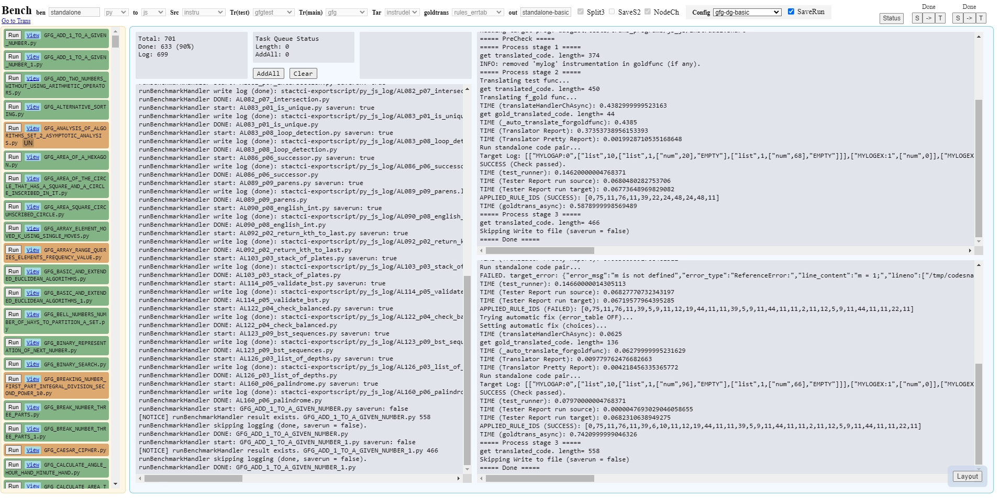
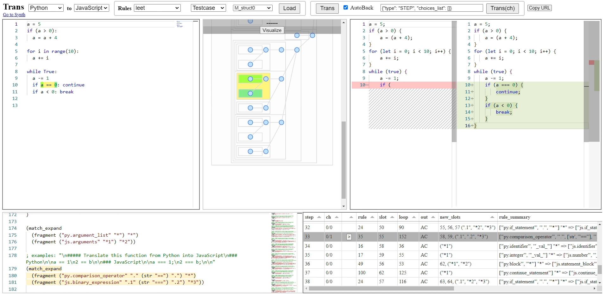
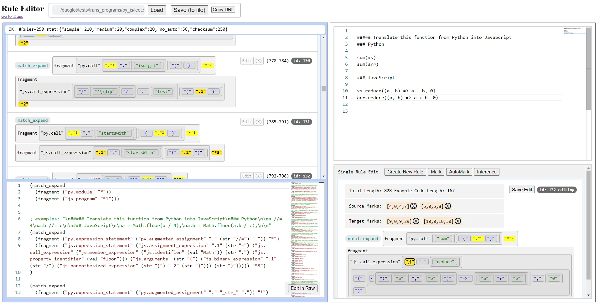
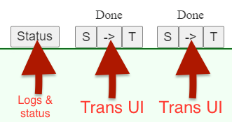
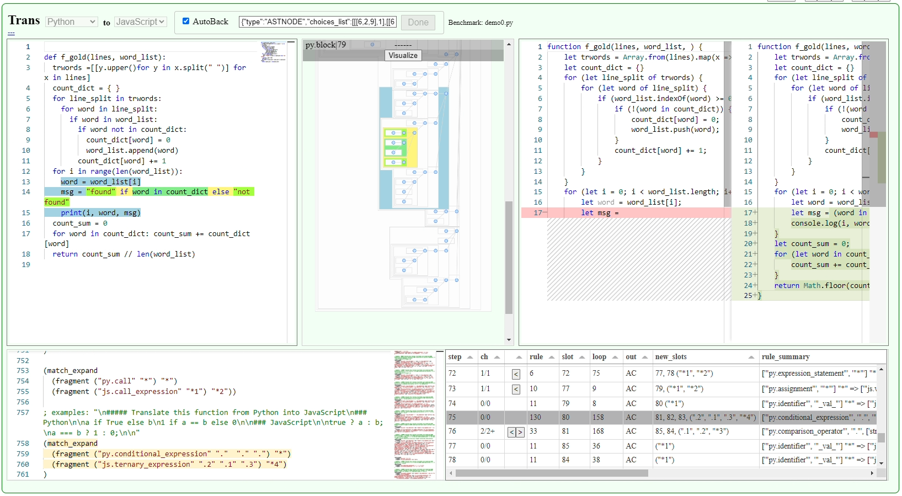
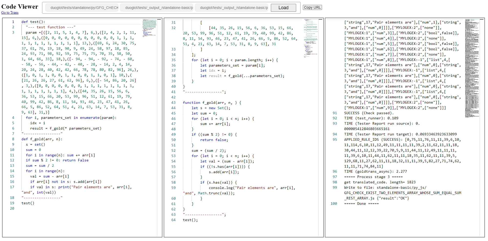
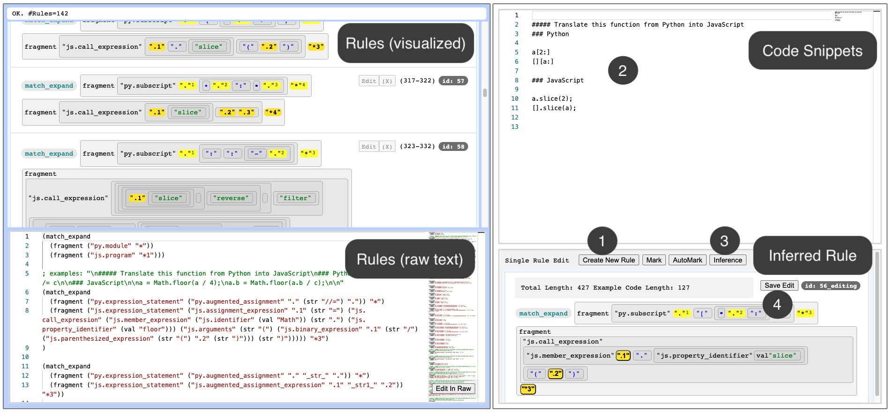
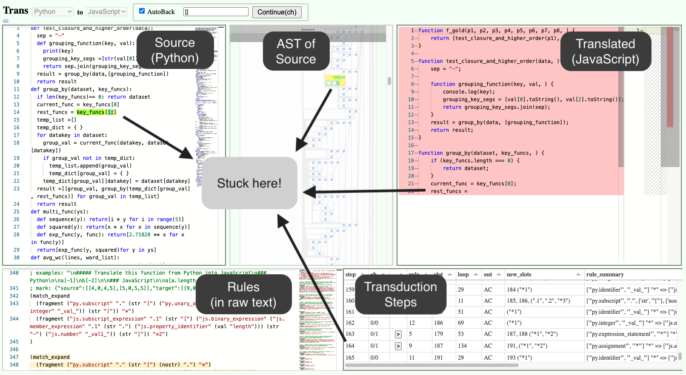
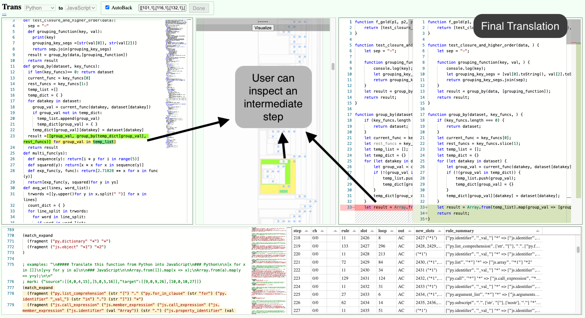

# DuoGlot: A User-Customizable Code Translator

> Paper: **User-Customizable Transpilation of Scripting Languages** in OOPSLA 2023

## License

Main part of the code is under MIT License.
Some dependencies and datasets are under other licenses. See [DEPENDENCY.md](./DEPENDENCY.md) for details.
## Introduction

This artifact `DuoGlot` is a customizable code translator. Translation rules in `DuoGlot` are synthesized from user-provided code snippets. It iteratively explores possible translations given the provided translation rules until finding a translation that passes tests.

`DuoGlot` currently supports customized translation from Python to JavaScript for single-file standalone programs. 

This artifact includes code and datasets to reproduce all the main results in the paper. We provide scripts and user interfaces for evaluating `DuoGlot` and 4 existing techniques for Python to JavaScript translation (`Codex`, `Transcrypt`, `JavaScripthon`, `py2js`). The evaluation is done on 3 sets of benchmarks --- GeeksForGeeks (`GFG`)  benchmarks, `LeetCode` case study, and `CtCI` case study.

## Getting Started Guide

### **Step 1: Check basic requirements**
- `x64` architecture (due to compiled cython modules)
- `Docker` with the `docker-compose-plugin` (`Docker 20.10+` recommended. Lower versions are not tested)
- `Linux` (For the starting bash scripts. It is expected to work on any Linux distros, Although we only tested on `Ubuntu 18.04` and `Ubuntu 20.04`)

**Some Useful Tips** 
- To check docker's version, you can run `docker info`. If resulting in permission denied, please follow the official [post-installation steps](https://docs.docker.com/engine/install/linux-postinstall/) to add docker permissions to the current user.

- To install docker with the `docker-compose-plugin`, you can follow the [official documentations](https://docs.docker.com/engine/install/ubuntu/). To check if `docker compose` is working, just type `docker compose` and you should be able to see the following:
  ```
  $ docker compose

  Usage:  docker compose [OPTIONS] COMMAND
  ...
  ```
  Note that this artifact cannot use the old `docker-compose` from  `Ubuntu`'s apt repository.

### **Step 2: Build and run the development container**

Run the command `./main-dev-cli.sh` to automatically build and start the development container. You should enter the container's CLI (`node ➜ /workspace (main ✗) $ `) after this command.

```
$ ./main-dev-cli.sh 
Sending build context to Docker daemon  5.632kB
Step 1/8 : FROM ...
Step 2/8 : RUN apt-get update && export ...
...
Successfully built 412a5e32b87a
Successfully tagged devprojbase:latest
devprojbase-container
node ➜ /workspace (main ✗) $ 
```

### **Step 3: Build all the docker images for evaluating `DuoGlot`**

Run the command `sudo ./main-dev-install.sh` **inside the development container**.

You should be able to see output like this:
```
node ➜ /workspace (main ✗) $ sudo ./main-dev-install.sh 
========= installing frontend dependencies (node_modules) =========
--------- install monaco ---------
...
+ monaco-editor@0.31.1
updated 1 package and audited 1 package in 3.504s
found 0 vulnerabilities

========= build docker images (using host docker) =========
--------- build docker images: thirdparty ---------
Sending build context to Docker daemon  3.434MB
Step 1/21 : FROM continuumio/anaconda3
...
Successfully built 02a2f6e1c11a
Successfully tagged thirdp-duoglotcompare:latest

--------- build docker images: backendpybase ---------
Sending build context to Docker daemon  6.656kB
Step 1/6 : FROM python:3.9.13
...
Successfully built 8ecf0b5a1a25
Successfully tagged backendpybase:latest

--------- build docker images: backendtestingbase ---------
Sending build context to Docker daemon   7.68kB
Step 1/16 : FROM ubuntu:22.04
...
Successfully built a42d298f47c5
Successfully tagged backendtestingbase:latest

--------- build docker images: nginxbase ---------
Sending build context to Docker daemon  3.584kB
Step 1/2 : FROM nginx:1.21.6
...
Successfully built 4b7c97765cf1
Successfully tagged nginxbase:latest
node ➜ /workspace (main ✗) $ 
```

Then exit the development container. On the host system, run `docker image ls` at least the following 5 images should apear.
```
$ docker image ls
REPOSITORY             TAG       IMAGE ID       CREATED         SIZE
thirdp-duoglotcompare  latest    f6fb6f46da95   19 hours ago    5.45GB
nginxbase              latest    2c8d630f2bf5   2 days ago      163MB
backendtestingbase     latest    c2b2e13846ea   2 days ago      1.14GB
backendpybase          latest    b959be4717ba   2 days ago      1.07GB
devprojbase            latest    284e96d5a21b   2 days ago      1.49GB
```

### **Step 4: Starting DuoGlot Services**

Run the command `./main-host-start.sh` **on the host system (outside of the development container)**.

You should be able to see all containers up. On a separate shell, run `docker ps` to check if they are all running normally:

```
$ docker ps
CONTAINER ID IMAGE                  COMMAND               ... PORTS ...
9a582a6e411d thirdp-duoglotcompare  "/bin/bash"           ...                       
8fc8cb9205e0 backendpybase          "python server_files…"...                       
7a522e4640f5 backendpybase          "python server_trans…"...                       
0e5fe51d562c backendtestingbase     "python3 server_test…"...                       
6c77347bdf9c nginxbase              "/docker-entrypoint.…"... 127.0.0.1:8000->80/tcp ...
```

Notice that the `DuoGlot` is exposed at `127.0.0.1:8000`. Open the browser to visit different tools at different URLs:


- Link to the Benchmarks Runner (The one-stop-shop for running `DuoGlot` on all benchmarks):  
  http://127.0.0.1:8000/frontend/duoglot/index_bench.html
    
- DuoGlot Trans UI:  
  http://127.0.0.1:8000/frontend/duoglot/index_t.html    
    
- Rule Editor UI:  
  http://127.0.0.1:8000/frontend/duoglot/index_editrule.html
    

If you can successfully load those pages, then it's good to go. How to use those UIs will be explained in the `Step-by-Step Instructions` and `More info for users`.

### **Step 5: Start the container for running comparisons**

We provide a container for running the comparing translators (`Codex`, `Transcrypt`, `JavaScripthon`, `py2js`). Please run the following to start the container with a shell:  

```sh
cd ./docker/thirdparty
./cli-duoglotcompare.sh
```

You should be able to enter a bash shell inside the container. Then you can run `conda env list` to check if it outputs the following:
```
(base) conda env list
# conda environments:
#
base                  *  /opt/conda
py27                     /opt/conda/envs/py27
py38                     /opt/conda/envs/py38
py39                     /opt/conda/envs/py39

(base)
```

Those four conda environments will be used for evaluating each of those translators in comparison. Details will be provided in the `Step-by-Step Instructions`.

## Step-by-Step Instructions 

### **Step 1: Start DuoGlot services**

Same as the **Step 4** in the `Getting Started Guide`. Run the command `./main-host-start.sh` **on the host system (outside of the development container)**. 


### **Step 2: Check if the `DuoGlot` pipeline is working**

Open Bench UI (http://127.0.0.1:8000/frontend/duoglot/index_bench.html), choose `gfg-dg-basic` in the config dropdown menu at the top. 

Scroll to the bottom on the file list (left), you should be able to see `demo0.py` and `demo1.py` at the end of the list.


Click the `Run` button of the `demo0.py`. If you see log like the below (with a line `SUCCESS (Check passed)`) on the right, it means the translation is sucessful:
```
SUCCESS (Check passed).
TIME (test_runner): 0.082
TIME (Tester Report run source): 0.00000509992241859436
TIME (Tester Report run target): 0.06883789412677288
APPLIED_RULE_IDS (SUCCESS): [0,75,11,76...
TIME (goldtrans_async): 4.335600000143051
===== Process stage 3 =====
get translated_code. length= 1337
Skipping Write to file (saverun = false)
===== Done =====
```

Switch the panel by clicking the buttons on the top right corner. The `Status` panel is the first panel you see when loading `Bench UI`. It shows the status and logs. On its right, there are two instances of `Trans UI`. Benchmark files will be automatically loaded into those `Trans UI` and get translated and retried automatically. Buttons "`->`" you lead you to Python-to-JavaScript `Trans UI`. Buttons `S` and `T` are for in-language transformations and you can ignore them.



By clicking on the "`->`" button, you should be able to see the detailed translation steps in the Trans UI of `demo1.py` you just ran.



**NOTICE: You can only view the translation but not alter the translation manually here because it is disabled for evaluation as mentioned in the paper.**

### **Step 3: Evaluate DuoGlot on GFG Benchmarks**

Open Bench UI (http://127.0.0.1:8000/frontend/duoglot/index_bench.html), choose `gfg-dg-basic` in the config dropdown menu at the top. 

Then check the `SaveRun` checkbox on the top (otherwise translation results will not be saved). After that, click `AddAll` button in the middle to add all 699 GFG benchmark files to the evaluation queue.

Wait for around 1 hour to finish.

After it finishes, refresh the page and choose `gfg-dg-basic` configuration again. You should be able to see the following on the left:
```
Total: 701
Done: 633 (90%)
Log: 699
```

It means that all 699 benchmark files are finished and the correct rate is `90%`.
On the left, you should be able to see benchmark files in green color (correct) and orange (failed).

For each benchmark file, you can check the log and the translation (wrapped with tests) by clicking the `View` beside the `Run`. It should bring you to the result viewer UI:



To validate figure 12 and 13 in the paper, we processed the generated log files for all the benchmarks in a half-manual way:
- At the end of each log of the successful translation, there exists a line `APPLIED_RULE_IDS (SUCCESS): [0, 75, 11, 76 ....]` This list is the list of rules (indexes) to produce the translation.
- Aggregate all the `APPLIED_RULE_IDS (SUCCESS)` and sort rule indexes according to the frequency, we can get figure 13.
- Add rules according to `APPLIED_RULE_IDS (SUCCESS)` after each benchmark file and rerun all the benchmarks to get number of correct results, we can get figure 12. Alternatively, we can check if the set of rules cover the `APPLIED_RULE_IDS (SUCCESS)` of a benchmark to know if it can be successfully translated if we perform the translation.

### **Step 4: Evaluate DuoGlot on Case Study 1 - LeetCode**

Open Bench UI (http://127.0.0.1:8000/frontend/duoglot/index_bench.html), choose `leetcode-dg-nch` in the config dropdown menu at the top. 

Then check the `SaveRun` checkbox on the top (otherwise translation results will not be saved). After that, click `AddAll` button in the middle to add all 1067 LeetCode programs to the evaluation queue.

Wait for around 1 hour to finish.

After it finishes, refresh the page and choose `leetcode-dg-nch` configuration again. You should be able to see the following in on the left:
```
Total: 1067
Done: 804 (75%)
Log: 1067
```

It means that all 1067 benchmark files are finished and the correct rate is `75%`.
On the left, you should be able to see benchmark files in green color (correct) and orange (failed). Similar to the previous step, you can check the result and the log.

### **Step 5: Evaluate DuoGlot on Case Study 2 - CtCI**

Open Bench UI (http://127.0.0.1:8000/frontend/duoglot/index_bench.html), choose `ctci-dg-nch` in the config dropdown menu at the top. 

Then check the `SaveRun` checkbox on the top (otherwise translation results will not be saved). After that, click `AddAll` button in the middle to add all 25 CtCI programs to the evaluation queue.

After it finishes, refresh the page and choose `ctci-dg-nch` configuration again. You should be able to see the following in on the left:
```
Total: 25
Done: 14 (56%)
Log: 25
```

It means that all 1067 benchmark files are finished and the correct rate is `56%`.
On the left, you should be able to see benchmark files in green color (correct) and orange (failed). Similar to the previous step, you can check the result and the log.

### **Step 6: Export unit tests for comparisons**

Open Bench UI (http://127.0.0.1:8000/frontend/duoglot/index_bench.html), choose `gfg-exportscript`/`leetcode-exportscript`/`ctci-exportscript` in the config dropdown menu at the top. 

Then check the `SaveRun` checkbox on the top (otherwise translation results will not be saved). After that, click `AddAll` button in the middle.

All the export-unit-test tasks should succeed. You need to run this for all of the three benchmarks (`gfg-exportscript`/`leetcode-exportscript`/`ctci-exportscript` in the config).

**NOTE:** The exported scripts are saved to the following three folders:  

- `data/duoglot/tests/_output_/standalone-exportscript`
- `data/duoglot/tests/_output_/staleetcode-exportscript`
- `data/duoglot/tests/_output_/stactci-exportscript`

### **Step 7: Evaluate translators in comparison**

**NOTICE:** Make sure you have finished **Step 6** to export test scripts.

After that, you can evaluate the performance of the four translation tools in comparison: `Transcrypt`, `py2js`, `JavaScripthon` and `Codex`.

Concrete steps for evaluating each of the comparing tool is listed below:

- Steps for evaluating `Transcrypt` are at [data/duoglot/comparisons/try_transcrypt/README.md](./data/duoglot/comparisons/try_transcrypt/README.md)

- Steps for evaluating `JavaScripthon` are at [data/duoglot/comparisons/try_JavaScripthon/README.md](./data/duoglot/comparisons/try_JavaScripthon/README.md)

- Steps for evaluating `py2js` are at [data/duoglot/comparisons/try_py2js/README.md](./data/duoglot/comparisons/try_py2js/README.md)

- Steps for evaluating `Codex` are at [data/duoglot/comparisons/try_codex/README.md](./data/duoglot/comparisons/try_codex/README.md)

## More info for users

### How to create or modify rules?

**<span style="color:orange;">WARNING:<span>**
Please backup the rule file `./duoglot/tests/trans_programs/py_js/gfg.snart` first.

1. Go to the `Rule Edit UI` at http://127.0.0.1:8000/frontend/duoglot/index_editrule.html 

2. Enter the following path in the input box beside the `Load` Button: `./duoglot/tests/trans_programs/py_js/gfg.snart` (or you can use `./duoglot/tests/trans_programs/py_js/_temp.snart` to avoid messing up with `gfg.snart`)
  
3. Click the `Load` button to load rules into the editor.

4. How to create a new rule: Following the steps in the picture below. 
     - (1) Click `create new rule`
     - (2) type in code snippets. For example, the following snippets:
        ```
        ##### Translate this function from Python into JavaScript
        ### Python

        a[2:]
        [][a:]

        ### JavaScript

        a.slice(2);
        [].slice(a);
        ``` 
    - (3) click `automark` to identify code ranges of the intended syntax pattern.
    - (4) click `inference` to extract a rule. The rule should appear in the editor.
    - (5) Drag the inferred rule into the visualized rule list at the top-left.  
    - (6) The modification is stored in memory. To save to the file, you need to click `Save (to file)` button at the top.

    

5. How to edit an existing rule: Click the `Edit` button on the right side of a rule. Remove the existing `Source Marks` and `Target Marks` (if any) by clicking on `X` buttons. Then modify the code snippets. The rest is the same as creating a rule. After generating the updated rule, click `Save Edit`. The modification is stored in memory. To save to the file, you need to click `Save (to file)` button at the top.

6. How to edit rules directly in text form: Click the `Edit in Raw` button at the bottom of the left-bottom raw text editor. This opens up the full-page text editor. Modify the rules and then `Save & Reload`. This will directly save to the file and reload the page.

**NOTE:** If the `AutoMark` gives wrong marks, you can mark code patterns manually. Select a range in the code snippet editor and click `Mark`. Do this multiple times to create marks for both the source and the target.

### How to use the Trans UI?

The `Trans UI` embedded inside the `Bench UI` is mainly used for inspecting translation steps or investigating stuck translations. If a translation failed, you can scroll to the last transduction step (right-bottom) to check the corresponding source:



After getting the correct translation, you can also use `Trans UI` to check step-by-step how the translation is generated.



The right side of the diff viewer (on the right) is just to help you debug. For example. you can put different versions of the same translation on the right side of the diff viewer for comparison. The translation result will be put into the left side of the diff viewer.

You can also use the `Trans UI` without the test-driven loop by going to [http://127.0.0.1:8000/frontend/duoglot/index_t.html](http://127.0.0.1:8000/frontend/duoglot/index_t.html) and choosing a ruleset and a code file to load and translate. For example, you can choose `leet` as the ruleset, and the following as the `Single File` path:
```
./duoglot/tests/staleetcode/pysep/L0003_LongestSubstringWithoutRepeatingCharacters.py
```
Then you can click `Load` and then `Trans(ch)` to translate the code. In the transduction steps shown at the bottom-right, you can click the buttons "`<`" / "`>`" to change a transduction step choice to use alternative rules, and then click `Trans(ch)` to get an altered translation.

You can also modify the code on the left and then click `Trans(ch)`. However, you might need to reset the rule choices 

## More info for developers

### How to evaluate DuoGlot on new benchmarks?

1. Modify the configs in `frontend/duoglot/index_bench_config.js` to include a new entry:
    ```json
    {
      "name": "<benchmark-name>",
      "value": {
        "benchfolder-input": "<input-folder>",
        "transprog-source-select": "",
        "transprog-transtest-select": "<ruleset-for-translating-unit-tests>",
        "transprog-trans-select": "<ruleset-for-translating-main-program>",
        "transprog-target-select": "",
        "outpath-input": "<output-folder>"
      },
      "checked": {
        "split3-check": true,
        "savestage2ret-check": false,
        "nodech-check": true,
      },
      "goldtrans": "rules_default"
    }
    ```
2. Save benchmark files at `./data/duoglot/tests/<input-folder>/py/*.py`. Each file should have the following content:
    ```py
    def test():
      # unit-tests
      ...
    "-----------------"
    # main-program
    "-----------------"
    test()
    ```

3. Then you should be able to see this configuration in `Bench UI` and run benchmark files inside it. Translation results should appear at `./data/duoglot/tests/_output_/<output-folder>`.


### How to extend to other languages?

1. Download and build the tree-sitter parser for the intended language in the folder `backend/duoglotcore-server/tree-sitter-util/`, similar to Python and JavaScript.

2. The tree-sitter support for languages is configured at lines 69-133 of `backend/duoglotcore-server/server_trans.py`. You can add support for another language similarly as Python and JavaScript.

3. Add pretty-printing support in the function `pretty_mapanno_ast` in `backend/duoglotcore-server/ast_pretty.py` to convert AST into code. This is the most tricky part.

4. Add code formatting support in the function `beautify` in `backend/duoglotcore-server/code_beautify.py`. Notice that the caller of `beautify` assumes that the code formatting operation will not change any non-empty characters. Otherwise, it will result in assertion failures.

### Folder Structure and Components
- `.devcontainer`: Resource for building development container
- `backend`
  - `duoglotcore-server`: DuoGlot Core
  - `file-server`: Delegate File I/O for the Web UI
  - `test-server`: Delegate testing for the Web UI
- `docker`
  - `backendpybase`: Resource for building the image for DuoGlot Core & file server
  - `backendtestingbase`: Resource for building the image for the test server
  - `nginxbase`: Resource for building the image for nginx (The reverse proxy for both the frontend and the backend)
  - `thirdparty`: Resource for building the image for running other tools for comparison
- `frontend`
  - `_api`: Wrapping backend APIs as functions in frontend
  - `_common`: Libraries for building UI (code editor, renderer, etc)
  - `duoglot`: DuoGlot's corresponding user interface
